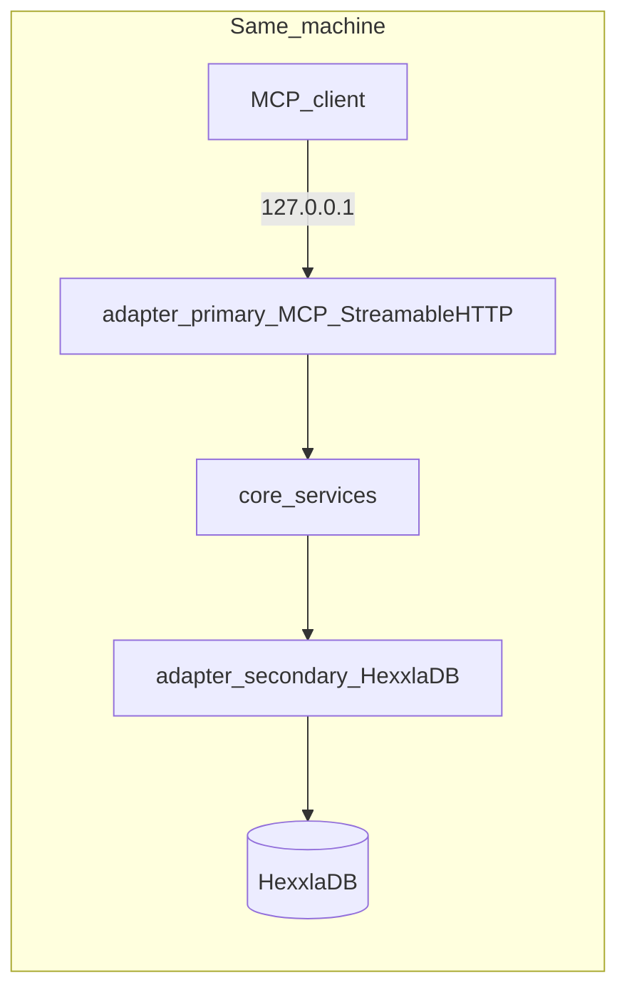

# MCP server blueprint (local HexxlaDB tools)

**Status:** implementation plan for the `mosaic` repository
**Scope:** local-only [Model Context Protocol](https://modelcontextprotocol.io/docs/getting-started/intro) server exposing **tools** that operate on a [HexxlaDB](https://github.com/hexxla/hexxladb) database over **Streamable HTTP**, with **no application-layer HTTP authentication** in v1.

This document is intentionally smaller in scope than [MOSAIC.md](./MOSAIC.md), which describes the full Hexxla memory OS. The milestone here is a **clean, local MCP surface** backed by HexxlaDB primitives.

---

## Goals

| Goal | Notes |
| --- | --- |
| MCP tools for HexxlaDB | LLM-callable tools map to use cases that call HexxlaDB (`Open`/`View`/`Update`, cells, seams, query/search as needed). |
| Streamable HTTP | Single MCP endpoint (e.g. `POST /mcp`) per [Streamable HTTP](https://modelcontextprotocol.io/specification/draft/basic/transports); messages are JSON-RPC (MCP encodes operations that way). |
| Local only | Bind **loopback** (`127.0.0.1`), not all interfaces. |
| No HTTP auth in v1 | Trust boundary is the **local machine**; protect data with **HexxlaDB at-rest encryption** (optional) and **OS file permissions** on the database path. |
| Hexagonal layout | Follow [hexagonal design flow](../architecture/hexagonal-design-flow.md): domain → ports → services → adapters. |

## Non-goals (v1)

- Monetization, billing, multi-tenant SaaS, or identity products.
- Remote exposure, TLS termination, API gateways, OAuth/OIDC, or bearer tokens on the MCP HTTP server.
- Full MOSAIC runtime (seed policies, seam auto-detection, token budgeting) unless pulled in incrementally after the thin MCP + DB path works.

If this server is ever exposed beyond localhost, add **TLS + authentication** first; that is out of scope for this blueprint.

---

## Architecture (hexagonal)

Place implementation along existing layer boundaries (see [internal/README.md](../../internal/README.md) and layer READMEs).

| Layer | Responsibility |
| --- | --- |
| `internal/adapter/primary` | Streamable HTTP MCP transport: parse JSON-RPC framing, session/MCP lifecycle, register tools, dispatch to application services. |
| `internal/core/ports/primary` | Use-case interfaces (what the MCP layer may call). |
| `internal/core/services` | Orchestrate tool logic, transactions, validation; no direct import of adapter implementations. |
| `internal/core/ports/secondary` | Contracts for “open DB”, “run in tx”, etc., implemented by the Hexxla adapter. |
| `internal/adapter/secondary` | HexxlaDB-backed implementation: `github.com/hexxla/hexxladb` open options, path, encryption key loading. |
| `internal/config` | Validated config: listen address (default loopback), port, DB path, encryption key source via environment (see project security rules: no hardcoded secrets). |
| `cmd/...` | Composition root: construct config, DB, services, MCP server, start HTTP server. |

The domain package may hold small value types and invariants for coordinates, tool inputs, and error shapes as features grow; keep [core/domain purity](../../internal/core/domain/README.md) (no internal imports).

---

## Transport and protocol

- **Protocol:** MCP over **Streamable HTTP** — clients send JSON-RPC messages with `POST` to one endpoint; responses may be JSON or SSE as required by the client and spec.
- **Binding:** Listen on **`127.0.0.1`** only unless an explicit future requirement changes deployment (default should remain loopback).
- **Origin:** Per the Streamable HTTP security section, validate the **`Origin`** header to mitigate DNS rebinding when HTTP is in use.
- **Spec note:** The same transport document recommends authentication for general deployments; this project **intentionally omits HTTP auth** while deployment is **localhost-only**, and relies on encryption-at-rest and filesystem permissions instead.

References:

- [What is MCP?](https://modelcontextprotocol.io/docs/getting-started/intro)
- [Transports (stdio and Streamable HTTP)](https://modelcontextprotocol.io/specification/draft/basic/transports)

---

## Security model (v1)

| Concern | Approach |
| --- | --- |
| Network exposure | Default bind `127.0.0.1`; do not listen on `0.0.0.0` for this milestone. |
| DNS rebinding | Implement `Origin` validation for Streamable HTTP as required by spec. |
| Data at rest | Use HexxlaDB encryption options (**e.g.** `EncryptionKey` / passphrase patterns) per [HexxlaDB encryption documentation](https://github.com/hexxla/hexxladb/blob/main/docs/hexxladb/ENCRYPTION.md) in the upstream repository — load secrets from environment or secure config loaders only (see [AGENTS.md](../../AGENTS.md) security expectations). |
| Logs | Do not log keys, paths that reveal secrets in shared logs, or full cell payloads if they contain PII. |

---

## Tool surface (alignment with MOSAIC)

[MOSAIC.md](./MOSAIC.md) defines a fuller **Agent Tooling Surface** (for example `put_memory`, `search_and_load_context`, seam tools, temporal views). Implementation can proceed in slices:

1. **Thin vertical slice:** open DB, health or minimal read, one write path (e.g. put cell or equivalent primitive) to prove MCP → service → HexxlaDB.
2. **Expand** toward the MOSAIC tool list as domain and services grow, mapping each tool to primary ports and Hexxla transactions.

Exact tool names and parameters should stay stable once published to clients; version protocol changes with MCP `protocolVersion` as needed.

---

## Configuration (illustrative)

Keep a single, validated struct in `internal/config`, loaded at startup in `cmd`:

- **HTTP:** host `127.0.0.1`, port (e.g. configurable flag/env).
- **Database:** file path; Hexxla `Options` (MVCC, embedding dimension, etc.) as required.
- **Encryption:** key material via environment (or key file path with restrictive permissions), never committed.

---

## Delivery checklist (v1)

- [x] Streamable HTTP MCP server on loopback (SDK `NewStreamableHTTPHandler`; DNS rebinding protection via [`github.com/modelcontextprotocol/go-sdk`](https://github.com/modelcontextprotocol/go-sdk)).
- [ ] Tool handlers implemented through `core/services` and `ports`, with HexxlaDB behind `ports/secondary`.
- [ ] Optional at-rest encryption wired through HexxlaDB options and secure key loading.
- [x] Config: `MOSAIC_MCP_ADDR`, `MOSAIC_MCP_PATH` with loopback-only validation (`internal/config`).
- [ ] Tests: unit tests for services with fakes; integration tests tagged if hitting a real DB file (per project conventions).
- [x] Documentation: this file + link from [MOSAIC.md](./MOSAIC.md).

---

## Future (not committed)

- Expose service on a network → TLS, strong authentication, and rate limits **before** wide exposure.
- Broader MOSAIC behaviors (seed selection, budgeted context packs, seam automation) as separate milestones on top of the same hexagonal structure.
